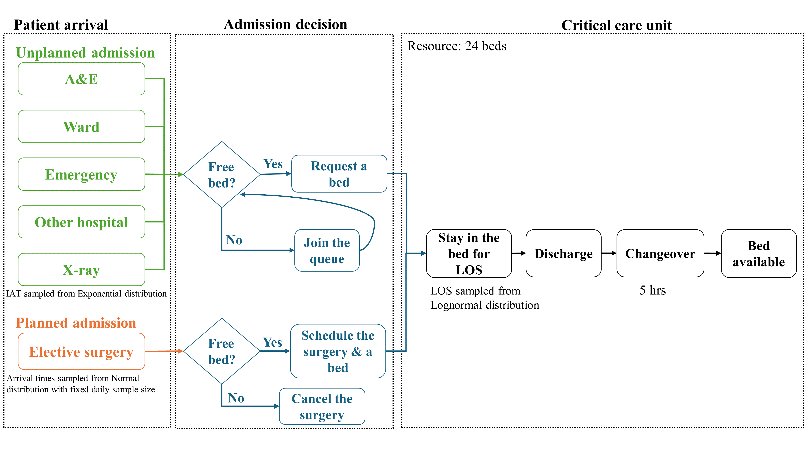

# Recreating a discrete-event simulation model of critical care unit 

HPDM097 (Making a difference with health data) Coursework project created by Shuhe Li and Meg Whitehouse

## Abstract

Strategically  managing  critical  care  resources  is  essential  to  optimise  bed  occupancy  and reduce elective surgery cancellations. This study aims to replicate the discrete event simulation model developed by Griffiths et al. We utilised an iterative approach assisted with a Large Language Model, implementing the model in Python and SimPy across three iterations. These iterations  included  simulating  emergency  admissions,  elective  surgery  patient  activity,  and incorporating a changeover period. The final model allows for single or multiple runs, with 21 replications determined as the optimal number using the confidence interval method. In the baseline scenario with 24 beds, the model recorded 1,536 admissions, an average occupancy of 23.03 beds, and 535 elective surgery cancellations. However, these outcomes demonstrated significant differences compared with actual data (all P<0.05). Additionally, a scenario test suggested  that  increasing  the  number  of  funded  beds  decreased  both  elective  surgery cancellations  and  occupancy  rates.  Despite  its  efficacy  in  simulating  patient  activities,  our model  could not fully  replicate the original due to incomplete knowledge  of the  statistical distributions for elective surgery patients.  

## Model Description

In the paper published by Griffiths et al. (2010), the simulation model admits patients from two different routes: `"unplanned admission"` and `"planned admission"`. In the former route, patients from five various sources have to wait until a bed is available, then they can enter the unit and stay there for a specific period of time to receive therapy. After the treatment is completed, they will leave the system immediately. In the latter route, elective surgery patients can only enter the system when there is a free bed, or they have to cancel the surgery if no bed is available at present. After their admission and treatment, they will leave the system immediately. A period of changeover is necessary after their discharge. The diagram of the model is displayed in Figure 1.

<em>Figure 1. Critical care unit simulation model diagram. IAT: inter-arrival time; LOS, length of stay..</em>

## Parameters
The input parameters that configure each simulation are:

**Inter-arrival time, IAT & daily arrivals**

Intervals of patient arrivals. For elective surgery patients, we modelled their daily arrival times.

| Source        	| Distribution 	| Mean (hours) 	| Standard Dev (hours) 	|
|-------------------|--------------	|-------------	|-----------------------|
|  A&E              | Exponential  	| 22.72         |                       |
|  Ward             | Exponential  	| 26.0          |                       |
|  Emergency        | Exponential  	| 37.0          |                       |
|  Other hospitals  | Exponential  	| 47.2          |                       |
|  X-Ray            | Exponential  	| 575.0         |                       |
|  Elective, daily arrivals         | Normal    	| 17.91         |  3.16                 |

  
**Length of stay, LOS**

The time patients spent in the CCU.

| Source        	| Distribution 	| Mean (hours) 	| Standard Dev (hours) 	|
|-------------------|--------------	|-------------	|-----------------------|
|  A&E              | Lognormal  	| 128.79        |  267.51               |
|  Ward             | Lognormal  	| 177.89        |  276.54               |
|  Emergency        | Lognormal  	| 140.15        |  218.02               |
|  Other hospitals  | Lognormal  	| 212.86        |  457.67               |
|  X-Ray            | Lognormal  	| 87.53         |  108.15               |
|  Elective         | Lognormal    	| 57.34         |  99.78                |

**Changeover time**

After each discharge, the time required for bed and the surrounding area cleaning.      

| Source        	| Distribution 	| Mean (hours) 	| Minimum (hours) 	| Maximum (hours) 	|
|-------------------|--------------	|-------------	|-----------------------|-----------------------|
|  Changeover              | Triangular  	| 5        |  2               |  8               |

## Scenario test
-   Base scenario: 24 beds
-	Changing the number of funded beds (ranging from 22 to 29)

## Outcomes
Primary outcomes include:
- Mean number of beds occupied
- Number of elective surgery cancellations
- Total admissions count

Secondary outcomes include:
- Occupancy rate
- Mean beds in queue	
- Mean waiting hours
- Admissions from six sources

## Environment

Set up a virtual conda environment to run the simulation:

> conda env create -f environment.yml

> conda activate simulation-dev

## Reference
J D Griffiths, M Jones, M S Read & J E Williams. A simulation model of bed-occupancy in a critical care unit. Journal of Simulation, 2010 4:1, 52-59, DOI: https://doi.org/10.1057/jos.2009.22 

